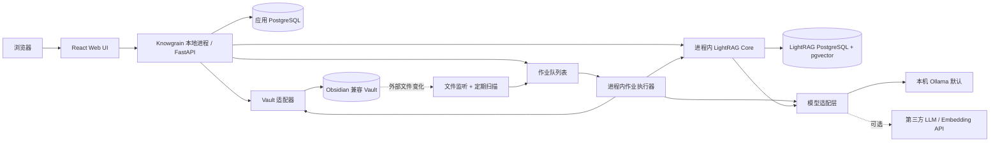

# Knowgrain：LightRAG + Obsidian 兼容 Wiki 架构与开发计划

状态：架构与实施计划（2026-09-30）；当前实现进度见第 9 节。

## 1. 产品定位与首版假设

Knowgrain 是一个以 Web 为操作界面的知识库产品：导入资料，利用 LightRAG 构建可检索的知识索引，生成有来源的 Wiki 页面，并将页面保存为 Obsidian 可直接打开的 Markdown Vault。Obsidian 桌面或移动应用是可选客户端，不是服务端依赖；首版不复制其私有应用实现。

本方案先按**单用户、本地或内网部署**设计；导入格式先覆盖 Markdown、TXT、PDF、DOCX。用户若选择团队或公网部署，需要在实施前扩展第 11 节的身份、隔离和运维设计。

### 目标

1. 用户可从 Web 导入、追踪、更新和删除资料。
2. 从资料生成可编辑、有双向链接、逐条可追溯到原文的 Wiki 草稿。
3. Web 可搜索和编辑 Wiki；同一 Vault 可由 Obsidian 打开和编辑。
4. Web 问答同时显示答案、证据摘录、源文件和索引版本；点击证据能打开对应 Vault 页面。
5. 文件变化可增量重建索引；失败可重试；人工审阅的内容不会被自动生成覆盖。

### 首版不做

- 实时多人协作、SaaS 多租户、完整 Obsidian 插件生态和移动端原生应用。
- 无人审阅的自动发布，以及宣称 LLM 输出“绝对正确”。
- 将 Markdown 当作向量库或图数据库。

## 2. 核心数据归属

| 数据 | 权威位置 | 是否可重建 | 规则 |
| --- | --- | --- | --- |
| 原始资料 | Vault `Sources/Files/` | 否 | 导入时保留原件及 SHA-256；更新创建新修订。 |
| 已审阅 Wiki 正文 | Vault `Wiki/` Markdown | 否 | 人工修改优先；生成器只提交更新提案。 |
| 未审阅 Wiki 草稿 | Vault `Wiki/Drafts/` Markdown | 可重新生成，但仍保留编辑历史 | 只有未人工修改的草稿可自动替换。 |
| 证据摘录页 | Vault `Sources/Evidence/` Markdown | 是 | 由源修订和检索块生成，提供可点击的块锚点。 |
| LightRAG 的 KV、向量、图谱、文档状态 | PostgreSQL 的 LightRAG 数据库 | 原则上从原始资料重建 | 不直接由前端或 Vault 文件写入。 |
| 作业、版本、页面映射、事件 | PostgreSQL 的应用数据库 | 部分可扫描 Vault 恢复 | 记录同步与审阅过程；需备份。 |

**不变量**：`Sources/Files/` 与已审阅的 `Wiki/` 是长期内容；LightRAG 索引和证据摘录是派生结果。删除或重建索引不能删除权威文件。

## 3. 总体架构



**修订后的首版选型：LightRAG Core 作为 `lightrag-hku` Python 依赖集成在 Knowgrain 本地后端，不启动独立的 LightRAG Server。**Knowgrain 负责产品语义：资料版本、文件解析、Wiki 页面、证据映射、审阅和外部编辑冲突；LightRAG Core 负责文本分块、实体关系抽取、图谱与向量检索。浏览器只访问 Knowgrain API，不直接访问 LightRAG 或数据库。

首版只有一个后端 OS 进程和一个 asyncio 事件循环：FastAPI 生命周期中创建一个 `LightRAG` 实例，执行 `await rag.initialize_storages()`，在退出时执行 `await rag.finalize_storages()`。同一进程的作业执行器消费 PostgreSQL 作业表，API 直接通过共享实例查询；不启动多个 Uvicorn worker，也不跨事件循环调用同步包装方法。耗时解析在有界线程池运行，索引/查询调用 LightRAG 的异步 API。后续如需拆出独立 Worker，先验证多进程写入和锁语义，再调整部署。

### 组件职责

| 组件 | 职责 | 不负责 |
| --- | --- | --- |
| Web UI | 上传、任务进度、Wiki 树、编辑器、反链、问答与证据面板 | 直接读写服务器文件系统 |
| Knowgrain API | 校验、权限、页面读写、搜索编排、返回可追溯响应 | 长时间运行的解析/索引任务 |
| 进程内作业执行器 | 导入、索引、生成、重建、删除和对账；重启后领取未完成任务 | 接收浏览器直连请求 |
| Vault 适配器 | 安全路径、Markdown/frontmatter、原子写入、哈希、链接解析 | LLM 推理与索引 |
| LightRAG Core 适配器 | 封装 `ainsert`、`aquery_data`、图谱及删除方法，归一化返回值，隔离上游版本变化 | Wiki 编辑规则 |
| 模型适配层 | 默认连本机 Ollama；配置后可连第三方 LLM/Embedding API；记录模型名和向量维度 | 在浏览器保存密钥 |
| Wiki 生成器 | 选题、证据筛选、草稿生成、引用校验和链接解析 | 直接覆盖已审阅页面 |
| 应用数据库 | ID 映射、修订、作业、审阅、反链投影 | 保存 Wiki 正文的唯一副本 |

### 技术选型

本地必须安装的服务、应用代码直接依赖、模型选项和安装顺序见 [依赖清单与本地安装建议](dependencies-and-local-setup.md)。其中 Obsidian 桌面应用是可选客户端；Docker 部署不要求宿主机另装 Python/Node 包。

- 前端：React + TypeScript + Vite；Markdown 编辑器使用 CodeMirror 6，预览器解析标准 Markdown 与 Obsidian `[[wikilink]]`。
- 后端与作业执行器：Python + FastAPI + `lightrag-hku`；Pydantic 定义接口；LightRAG Core 与应用代码同进程运行。
- 队列：先用 PostgreSQL 作业表、租约和 `FOR UPDATE SKIP LOCKED`，由同一后端进程的异步任务领取；首版不增加 Redis 或独立 Worker。
- 数据库：同一个 PostgreSQL 实例中分开应用数据库与 LightRAG 数据库。LightRAG 使用 `PGKVStorage`、`PGVectorStorage`、`PGTableGraphStorage`、`PGDocStatusStorage`；向量部分需 pgvector。图谱优先普通表实现，避免引入 Apache AGE。
- 模型：本地 Ollama 是默认实现；LLM 和 Embedding 由适配层注入 LightRAG。第三方服务使用配置切换，密钥留在后端。正式导入前固定 Embedding 模型与维度。
- 部署：Docker Compose 首版仅需 Knowgrain 后端和 PostgreSQL；前端构建产物由后端提供。Ollama 默认在宿主机运行，Vault 使用宿主机目录绑定挂载到后端，使本机 Obsidian 可打开同一目录。源码开发可另跑 Vite 热更新服务。

### 嵌入式 Core 的实施边界

后端启动时先加载 `POSTGRES_*` 连接信息和模型配置，验证 Ollama 的 LLM/Embedding 可用性与向量维度，再构造 `LightRAG`。构造参数明确指定四种 PostgreSQL 存储、`working_dir`、`llm_model_func`、`embedding_func`，而非使用默认的 JSON/NetworkX/NanoVectorDB 存储。随后在同一事件循环执行 `initialize_storages()`；关闭应用前停止领取新任务，等待或记录在途作业，再执行 `finalize_storages()`。应用只通过自有 `LightragCoreAdapter` 暴露 `index(revision, text)`、`retrieve(question)`、`delete(revision)` 等业务方法。

```text
Vault 原件 → 本地解析器 → index(revision_id, text, vault_path)
                                  └─ await rag.ainsert(text, ids=[revision_id], file_paths=[vault_path])
Web 提问 → retrieve(question) → await rag.aquery_data(question, QueryParam(mode="mix"))
                            → 当前修订过滤 → 证据映射 → 答案生成
```

上图是接口契约草图，具体 `ainsert` 参数与返回字段在 M0 用固定版本的 LightRAG Core 做集成测试。查询证据采用 `aquery_data`，因为它返回实体、关系、文本块和引用；应用对证据按当前源修订过滤后，再调用模型生成回答。此流程避免直接把可能过期的 LightRAG 内建回答展示给用户。

模型配置采用两个独立角色：`llm`（抽取、生成）和 `embedding`（建索引、检索）。默认角色都连本机 Ollama；启用第三方时分别配置 provider、base URL、model、密钥和超时。支持混用，例如本机 Embedding + 第三方 LLM。更换 LLM 可重新评估生成质量；更换 Embedding 模型、维度或查询/文档前缀必须重建索引。密钥只保存在后端本地配置，不写入 Vault 或浏览器。

## 4. Vault 规范与身份

M1 安装流程将应用数据库与一个 Vault 根目录绑定：`VAULT_ROOT` 是首次初始化位置，选定后的根目录由应用数据库 `vault_binding` 保存并在重启时恢复。Web 只允许预览和选择 `VAULT_PARENT_DIR` 下一个直接子文件夹，不能浏览宿主机任意路径。目录预览不产生写入；执行选择时核对绑定与原路径，防止旧页面覆盖新选择。数据库已有来源记录后禁止更换根目录；移动或恢复走 M5 的显式对账流程。首次接管已有来源数据库时，要检查每份原件路径和 SHA-256，错误时停用上传和索引。具体接口与验收见 [`m1-vault-setup-contract.md`](m1-vault-setup-contract.md)。

```text
vault/
  Sources/
    Files/                 # 原始文件，文件名以 source_id 前缀避免冲突
    Evidence/              # 可重建的证据摘录 Markdown
  Wiki/
    Drafts/                # 生成草稿
    Pages/                 # 审阅通过、可人工维护的页面
  .obsidian/               # 由 Obsidian 管理；本项目不覆写其设置
```

每个 Wiki 页面使用独立的 `kg_id`（UUID）作为稳定身份，路径仅作为展示位置。Web 或 Obsidian 改名、移动文件时，通过扫描 frontmatter 中的 `kg_id` 找回页面。页面标题和 LightRAG 实体名都不能单独充当永久 ID。

```yaml
---
kg_id: "9b18e5a1-7e96-4aa6-b64d-61a0d8b7ea45"
kg_kind: wiki
kg_status: draft
kg_sources:
  - "source-6f51b786"
kg_generated_from: "sha256:..."
kg_generator_version: "1"
---
```

正文的事实性段落使用到证据页的 Obsidian 链接，如 `[[Sources/Evidence/source-6f51b786#^ev-a39f|证据 1]]`。证据页记录原文摘录、原始文件链接、源修订哈希及可获得的页码/标题。Markdown 可直接在 Obsidian 中浏览；Web 以相同目标解析链接。对 PDF 等格式，首版保证“原文件 + 摘录”的定位；准确页码只在解析器提供可靠页码时显示。

## 5. 领域模型与映射

应用数据库至少包含：

| 表/实体 | 关键字段 | 用途 |
| --- | --- | --- |
| `source_document` | `id`, `vault_path`, `current_revision_id`, `state` | 一个逻辑来源，路径可变。 |
| `source_revision` | `id`, `source_id`, `sha256`, `lightrag_file_path`, `index_state`, `indexed_at` | 标识被索引的具体内容版本。 |
| `wiki_page` | `id`, `vault_path`, `status`, `content_sha256`, `generated_from_hash`, `reviewed_at` | 跟踪页面、审阅和并发修改。 |
| `evidence_ref` | `id`, `source_revision_id`, `lightrag_chunk_id`, `excerpt_sha256`, `evidence_vault_path`, `block_id` | LightRAG 检索结果到 Vault 证据块的映射。 |
| `page_evidence` | `page_id`, `evidence_id`, `claim_key` | 页面中的事实与证据关联。 |
| `page_link` | `from_page_id`, `to_page_id`, `link_text` | Web 反向链接索引；由 Markdown 扫描重建。 |
| `graph_binding` | `page_id`, `workspace`, `entity_name`, `binding_version` | 页面与当前 LightRAG 实体的关联；允许名称变化。 |
| `job` | `id`, `type`, `state`, `attempt`, `lease_until`, `input_hash`, `error` | 长任务、重试和状态显示。 |

`reference_id` 只作为单次查询展示编号；跨查询的持久映射使用本项目的 `source_revision.id`、`evidence_ref.id` 和可核验的内容哈希。若上游 chunk ID 改变，可重建映射，不改变 Wiki 页面 ID。

## 6. 核心流程

### 6.1 导入与索引

1. API 将上传写入临时位置，验证类型、大小和安全路径，计算 SHA-256。
2. Vault 适配器把原件原子移动到 `Sources/Files/`；应用数据库创建 `source_document` 和 `source_revision`，排入索引任务。
3. 进程内作业执行器读取 Vault 原件。Markdown/TXT 直接解码；PDF 用 `pypdf`、DOCX 用 `python-docx` 转为可审计的文本，保留原始文件和解析产物的哈希、页/段信息。随后调用 LightRAG Core 的异步导入方法，传入稳定的修订 ID 与来源路径，关联 `source_id` 和修订哈希。
4. 状态依次为 `queued → indexing → ready` 或 `failed`；只有 LightRAG 成功后才标为 `ready`。
5. 同一哈希重复导入不重复索引；失败保留原件并允许重试。

文件解析由 Knowgrain 管理，分块策略由 LightRAG Core 适配器配置。首版以文本为重点；扫描版 PDF 的 OCR、图片、表格和公式处理作为后续能力。PDF 页码只在解析与 chunk 映射可靠时展示，不能凭文件名推断。

### 6.2 Wiki 生成

1. 选题来源：用户指定主题、LightRAG 的热门实体，或已审阅页面的缺失链接。默认由用户确认选题。
2. 对每个主题调用 LightRAG Core 的 `aquery_data(..., QueryParam(mode="mix"))`，取得实体、关系、文本块及引用。
3. 生成器先形成结构化草稿：标题、摘要、章节、事实声明、声明对应的证据 ID、相关页面候选。再渲染 Markdown；不让模型直接决定文件路径。
4. 确定性校验：每个事实声明至少一个有效证据 ID；证据来自当前 `ready` 修订；摘录非空；内部链接目标存在或被明确标为待建页面。
5. 将草稿原子写入 `Wiki/Drafts/`，状态为 `draft`。审阅通过后移到 `Wiki/Pages/`，状态为 `reviewed`。

LLM 可能把真实证据解释错，因此“引用存在”不等于“结论正确”。Web 审阅界面要并排展示声明和原文，让用户完成语义核对。

### 6.3 Web 查询与反链

1. 用户在 Web 输入问题，或从 Wiki 页面选中一段文字发起查询。
2. API 调用共享的 LightRAG Core 实例 `aquery_data` 获取结构化证据，过滤已删除、过期或尚未完成索引的来源修订。
3. 回答生成器只使用过滤后的证据，返回 `answer`、按声明关联的 `citations`、`source_revision` 和 `index_freshness`。没有足够证据时返回“资料中未找到可核实依据”。
4. UI 的每个引用打开 `Sources/Evidence/` 的对应块，并能继续打开原始文件；反链侧栏同时展示引用当前页面的 Wiki 页面。

Obsidian 自身可识别 Wiki 页面之间的 `[[...]]` 反链。指向 LightRAG 实体、chunk 和源修订的反向映射由应用数据库及 Web UI 实现。首版的自然语言问答入口在 Web；若后续要求在 Obsidian 应用内直接提问，可增加一个只调用 Knowgrain API 的轻量插件，而不复制核心索引逻辑。

### 6.4 Web/Obsidian 双端编辑

- Web 保存页面时使用 `If-Match: <content_sha256>`；文件已在 Obsidian 中变化则返回 `409 conflict`，提供差异，而不是覆盖。
- 文件监听负责快速发现变化；定期全量哈希扫描弥补漏事件。扫描依据 `kg_id` 处理移动或改名，重新解析 `[[wikilink]]` 以更新 `page_link`。
- 审阅页面在外部修改后，页面正文立即以 Vault 文件为准，并将关联索引标为 `stale`；后台重新索引其可检索文本。
- 自动生成的草稿不直接回灌 LightRAG。已审阅页面若作为二次来源进入索引，标记 `source_type=curated_wiki`，检索时与原始证据分开呈现，避免 AI 反复引用自身摘要。
- 生成器发现目标页面已审阅或其哈希改变时，只创建更新提案和差异；不直接修改原文。

### 6.5 更新、删除和恢复

- 来源更新：先创建新修订并索引；查询只接受当前 `ready` 修订的证据。旧索引清理成功后再回收旧修订。这样多存储写入期间即使有短暂重复，也不会把旧证据交给回答生成器。
- 来源删除：先标记 tombstone 并立即从 Web 检索结果中过滤，再异步删除 LightRAG 索引；原件移到 `Trash/`，最终清理由明确的保留策略控制。
- 作业失败：记录阶段和错误；租约到期后可重试；以 `source_id + revision_hash + job_type` 保证重复运行可识别。
- 启动对账：比较 Vault 文件、应用数据库状态与 LightRAG 文档状态，产生修复任务。应用数据库丢失时可从 Vault 的 `kg_id`、原件和哈希恢复内容映射，再重建索引；审阅历史和作业日志仍依赖数据库备份。

### 6.6 知识关系与图谱工作区（必需交付）

LightRAG 的实体/关系抽取和 PostgreSQL 图谱索引属于核心目标。图谱页面也是 Web 完整交付范围；不能仅用实体反向链接列表替代可视化图谱。

**产品决策（用户明确，2026-10-02）：知识的语义关系由 LightRAG 自动维护，用户不需要像传统笔记流程一样手工创建和同步关系。** 原件和已审阅 Markdown 仍是内容权威，语义关系是从这些来源生成并可重建的派生数据。

- 自动维护闭环：首次导入建立实体和关系；资料新修订索引后替换当前成员投影；软删除立即排除关系成员，持久化 Core 清理完成后移除废弃记录；恢复/重建后重新计算。
- 多来源关系：一条关系可能由多份原件共同支撑，删除其中一份仅撤销该来源的支撑，不能误删仍有有效来源的共享实体和关系。
- 自动 Wiki 关联：由页面证据 ↔ Core 实体/关系成员计算相关 Wiki、关联知识及语义反向导航，不要求用户手动添加 `[[wikilink]]` 才能建立这些关联；随当前修订变化自动刷新。
- 双链接投影：已有 Markdown `[[wikilink]]`/反链表示文件中的显式链接；Core 派生关系表示自动语义关联。两者在 Web 中标明来源，并共同服务导航。关系变化不得自动重写已审阅正文；需要导出自动关系到 Vault 时采用独立派生文件，正文更新仍走差异提案和审阅。

- 关系构建：资料解析后由内嵌 Core 抽取实体与关系；保留能映射到来源修订和文本块的成员关系。实体和关系摘要是模型派生内容，不自动当作已审阅事实。
- 图谱内容：展示实体名称/类型、关系端点与说明，以及可验证的原文证据；显示涉及的来源修订、索引时间和有效性。关系的抽取结果不能宣称人工核实。
- Web 操作：节点与连线可视化、实体搜索、局部邻居展开、按来源/类型筛选、选择关系查看证据。规模超限时返回明确截断并分步加载。
- 双向导航：Wiki → 相关实体/关系；实体/关系 → 关联 Wiki → 精确原件/证据。浏览器始终通过 Knowgrain 自己的 API，不能直连图谱数据库或上游对象。
- 当前性：对节点和连线的来源成员执行与问答相同的 active、latest/current、ready 和修订哈希校验；删除/过期来源不能通过图谱重新进入新问答。
- 验收：真实样例经 Core 抽取产生实体和关系；图谱页显示节点及连线；点击关系能打开匹配修订的原文证据；更新/删除后失效成员被排除；已审阅 Markdown 不因图谱操作被修改。
- 自动维护验收：用户只导入/更新/删除资料，无需手动建边或添加 Wiki 链接，相关 Wiki 和关系投影随之变化；共享关系在仍有有效来源时保留；从原件重建后能恢复自动关系。

当前实现已有真实实体/关系索引及 Wiki ↔ 实体导航。关系证据浏览与完整可视化工作区尚未实现，列入 M6 Web 完善的必需项；M5 清理/恢复须保留图谱成员的正确性。

## 7. Web 页面与最小 API

| 页面 | 首版功能 |
| --- | --- |
| 资料库 | 上传、版本、解析/索引状态、失败重试、删除。 |
| Wiki 浏览器 | 目录、Markdown 预览、`[[wikilink]]`、反链、来源侧栏。 |
| Wiki 编辑器 | 编辑、预览、哈希冲突提示、草稿审阅、更新差异。 |
| 问答页 | 答案、逐条证据、源文件跳转、新旧索引状态。 |
| 图谱工作区 | 实体与关系可视化、搜索与筛选、邻居展开、关系原文证据及 Wiki 双向跳转。 |
| 任务页 | 导入、重建、生成任务及可操作错误。 |

建议的应用 API（版本前缀 `/api/v1`）：

| 方法与路径 | 语义 |
| --- | --- |
| `POST /sources`、`GET /sources` | 上传与列出原始资料。 |
| `POST /sources/{id}/reindex`、`DELETE /sources/{id}` | 重建索引、软删除。 |
| `GET /jobs/{id}` | 查询长期任务状态。 |
| `POST /wiki/drafts` | 按主题创建 Wiki 草稿任务。 |
| `GET /wiki/pages/{id}`、`PUT /wiki/pages/{id}` | 获取和并发安全地保存 Markdown。 |
| `POST /wiki/pages/{id}/review` | 审阅发布；校验引用和文件哈希。 |
| `GET /wiki/pages/{id}/backlinks` | 读取反链及 LightRAG 实体绑定。 |
| `POST /queries` | 返回答案、声明级引用、源版本和新鲜度。 |
| `GET /evidence/{id}` | 返回摘录、原件路径及 Vault 跳转目标。 |

所有文件路径都由服务端从 ID 查得；客户端不能传任意服务器绝对路径。Markdown 预览中的 HTML 和外部资源按受控策略渲染。长任务用作业 ID 查询状态，避免 HTTP 请求等待 LLM 完成。

## 8. 项目代码边界

```text
apps/
  web/                       # React 页面、Markdown 编辑/渲染、证据 UI
services/
  api/                       # FastAPI 路由、请求校验、鉴权
  runtime/                   # FastAPI 生命周期、LightRAG 实例和进程内作业执行器
packages/
  domain/                    # 领域类型、状态机、仓储接口
  vault/                     # Vault 文件、frontmatter、链接、冲突检测
  lightrag_core/             # 上游 Python Core 适配器与响应归一化
  model_providers/           # Ollama 默认实现和第三方模型配置
  parsers/                   # MD/TXT/PDF/DOCX 转文本与解析位置映射
  wiki/                      # 选题、证据校验、生成、Markdown 渲染
  provenance/                # 来源版本、证据映射、引用过滤
infra/
  compose/                   # 本地部署
  migrations/                # 应用数据库迁移
docs/
  architecture-and-development-plan.md
  dependencies-and-local-setup.md
```

上面的领域边界是长期规划。当前 Python 代码统一位于 `src/knowgrain/`：`api.py` 管理应用生命周期，`lightrag_runtime.py` 隔离 Core，`database.py`/`models.py`/`source_repository.py` 管理应用数据，`source_service.py`/`vault.py`/`parsers.py` 管理导入，`job_runner.py` 执行索引，`upload_limits.py` 限制请求体。M2 的 `wiki_api.py`、`wiki_service.py`、`wiki_files.py`、`wiki_repository.py` 分别负责 Wiki 路由、协调/监听、权威文件、数据库投影；契约见 [M2 文件契约](m2-wiki-contract.md)。迁移在 `infra/migrations/`，真实资料和 Wiki Web 在 `apps/web`。模块增长后再按这些领域拆包，不为目录规划制造空模块；前端始终只依赖 Knowgrain API 类型。

## 9. 开发阶段、依赖与验收

| 阶段 | 交付内容 | 可检验的完成标准 |
| --- | --- | --- |
| M0：基线 | Python 项目骨架、依赖锁文件、配置样例、Compose PostgreSQL、LightRAG 生命周期封装和 CLI | 真实 Ollama + PostgreSQL 16.14/pgvector 的 `ainsert → aquery_data` 已通过；启动步骤包含 `make tokenizer`。Compose PostgreSQL 18 与远端 CI 仍待执行。 |
| M1：资料与索引 | 上传、Vault 原件、版本/哈希、LightRAG 适配、任务状态 | 重复上传不重复索引；断网/模型失败后原件保留且可重试。 |
| M2：Wiki 文件层 | Markdown 页面、frontmatter、Web 浏览/编辑、`[[wikilink]]`、反链 | 同一 Vault 在 Web 与 Obsidian 中可读；外部编辑被发现；冲突返回 409。 |
| M3：生成与审阅 | 选题、结构化生成、证据页、引用校验、草稿/审阅 | 无来源的事实不自动发布；审阅页不会被再生成覆盖。 |
| M4：可追溯问答 | `/queries`、证据面板、文件跳转、修订过滤 | 所有展示引用均可打开；过期/删除来源不用于新答案。 |
| M5：更新与恢复 | 增量索引、软删除、作业租约、启动对账、备份恢复说明 | 注入中断后可恢复；源更新不导致旧证据被当成当前事实。 |
| M6：发布评估 | 样例集回归、性能基线、操作文档与打包 | 30 题人工评估正确率目标 ≥90%；引用可解析率 100%；人工审阅内容零覆盖。 |

依赖关系：`M0 → M1 → M2 → M3 → M4 → M5 → M6`。M2 的 Vault 页面与冲突规则是 M3 草稿落盘的前提。先完成从导入到有证据回答的纵向闭环，再扩展多模态和多用户。

实际进度见 [`development-status.md`](development-status.md)。M1 的原件存储、解析、修订、索引任务和 Vault 绑定已验证。M2 的手动 Markdown 创建/编辑/预览、内部链接/反链、外部改名/监听/409 冲突已通过真实本地 API 与浏览器验收。M3 的生成、审阅和更新提案，M4 的逐条引用问答及实体反向导航已完成本地流程验收。M5 的来源软删除、持久化 Core 清理及恢复重索引已验收；Trash 文件恢复仍在接入。完整图谱、自动 Wiki 语义关联、完整恢复/发布、安装向导和第三方模型适配仍待实现。以上路线图不能当成已实现功能清单。

每阶段应至少包含：可演示的用户流程、异常/恢复测试、数据库迁移、接口契约和简短的运维说明。M6 的正确率是验收目标，不是模型能力保证；需记录模型、提示词、资料集和评价人员，才能比较版本。

## 10. 质量与可观测性

- 记录每次导入、生成、查询的 `request_id`、源修订、模型配置版本和引用 ID；日志不默认保存完整私有文档内容。
- 仪表盘区分解析时间、抽取时间、检索时间、生成时间、LLM token 使用与失败率。
- 自动测试覆盖：文件路径穿越、原子写入、哈希冲突、断链、来源更新、任务重试、LightRAG Core 版本变化、事件循环生命周期与过期引用过滤。
- 评估集同时包含单文档事实、跨文档关系、无法回答、过时资料、同名实体五类问题。逐条记录答案是否由引用支持，而不只检查文字相似度。
- 独立备份 Vault 和 PostgreSQL；定期演练用 Vault 原件重建 LightRAG 索引。

## 11. 部署与扩展边界

首版服务默认只绑定本机；Knowgrain API 和它提供的 Web 静态资源是浏览器唯一入口。LightRAG Core 不对外开放端口，数据库不对浏览器开放。本机 Ollama 为默认模型服务；如果用户启用第三方模型，页面明确显示资料会发送给所选提供方。

如果后续转为团队部署，先增加用户身份、项目级权限、审阅角色、工作区隔离、TLS、配额和审计。公网 SaaS 还要设计租户边界、密钥管理与资源限流；不应仅靠 LightRAG `workspace` 字段代替应用权限控制。

## 12. 主要设计风险与决策

| 风险 | 处理方式 |
| --- | --- |
| LLM 抽取遗漏或编造关系 | 保存原始证据、声明级引用、人工审阅；对无法核实的回答返回不足。 |
| LightRAG 多存储之间无统一事务 | 应用侧作业状态、修订过滤、幂等重试与启动对账。 |
| Obsidian 外部编辑与 Web 写入竞争 | 内容哈希条件写、409 差异、监听加定期扫描。 |
| 图谱实体名与文件路径会变化 | 使用应用 UUID；名称和路径仅作为可变属性。 |
| 自动生成内容反复被模型索引 | 草稿不回灌；已审阅内容单独标注来源类型。 |
| 证据只能定位到文件而非段落 | 对 Markdown 建稳定块锚点；PDF 仅在可靠页码存在时显示页码，否则给原文摘录。 |
| 上游 LightRAG Core/存储配置变动 | `lightrag-hku` 固定版本、适配层、核心方法契约测试和升级迁移计划。 |
| 嵌入式 Core 的事件循环与并发问题 | 单后端进程持有实例；初始化、查询和作业均在同一事件循环调用异步方法；停机时释放存储。 |

## 参考资料

- [LightRAG 仓库与查询模式](https://github.com/HKUDS/LightRAG)
- [LightRAG API Server 与 PostgreSQL 存储配置](https://github.com/HKUDS/LightRAG/blob/main/docs/LightRAG-API-Server.md)
- [LightRAG 结构化查询接口](https://github.com/HKUDS/LightRAG/blob/main/lightrag/api/routers/query_routes.py)
- [LightRAG 文件处理管线](https://github.com/HKUDS/LightRAG/blob/main/docs/FileProcessingPipeline.md)
- [LightRAG Core 编程接口](https://github.com/HKUDS/LightRAG/blob/main/docs/ProgramingWithCore.md)
- [Obsidian 的数据存储方式](https://obsidian.md/help/data-storage)
- [Obsidian 内部链接与块链接](https://obsidian.md/help/links)
- [Obsidian Properties/frontmatter](https://obsidian.md/help/properties)
- [Knowgrain 依赖清单与本地安装建议](dependencies-and-local-setup.md)
