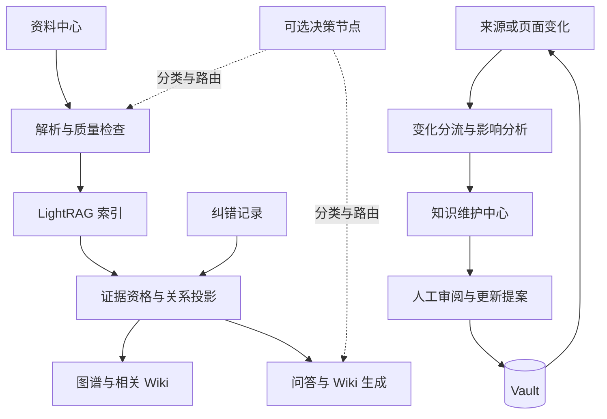

# Knowgrain 二期计划：知识维护与处理质量

规划日期：2026-10-08。状态：计划已建立，二期功能尚未实施。

本计划承接 [一期架构计划](architecture-and-development-plan.md) 和 [当前进度](development-status.md)。一期 M0–M6 的承诺继续有效；完整图谱、自动 Wiki 关联、安全重建和发布验收不因新增二期而延期或被视为完成。本文用于后续任务拆分；具体数据库迁移和跨模块 API 须在对应节点开始时完成 Sol 审查。

## 1. 当前基线与启动条件

以下基线来自仓库进度记录，不代表本次重新运行了验收。

| 范围 | 当前记录 | 与二期的关系 |
| --- | --- | --- |
| M1–M4 | 资料导入、Wiki 文件层、生成审阅、可追溯问答及实体导航已有本地验收 | 复用现有服务与用户流程 |
| M5 生命周期 | 软删除、Core 清理、Trash 恢复、启动对账和隔离备份恢复已有局部验收 | 二期影响分析须接入这些事件 |
| M5 重建基础 | identity、profile、ledger、preflight 等已有内部基础；正常 Runtime 尚未贯通 | 先完成协调器、成员审计、激活与重启恢复 |
| 图谱与自动 Wiki 关联 | 一期 §6.6 已明确要求，完整关系投影与 Web 工作区仍待完成 | 属于一期交付；二期在其上增加纠错和历史 |
| 模型配置及发布 | 第三方回调基础存在，正常运行仍使用 Ollama；安装与 M6 评估待验收 | 二期不替代这些工作 |

工作树中的 `core_audit.py` 当前为未跟踪草稿，不作为审计节点完成证明。实际启动二期前重新核对进度、代码和验收记录。

二期可提前编写契约和准备样例；依赖 Core 身份的功能实施须满足下列条件：

1. active generation、封存配置和实际运行 Core 一致；配置不匹配不能继续混写旧索引。
2. 完整重建经过成员审计、受控激活和中断恢复验收；普通任务遵守相同门禁。
3. 一期关系投影可返回有效来源成员、准确修订与证据；共享关系不会因删除单一来源被误删。
4. 不同原件解析为相同文本的成员归属策略已确定并验收。

一期 M6 验收完成后才能发布标记为二期的版本。不得用二期文档关闭未完成的一期任务。

## 2. 目标功能流程



原件与已审阅正文继续以 Vault 为权威。人工纠错、审阅历史和处理决定保存在应用 PostgreSQL，属于需备份的用户数据。Core 图谱与应用投影属于派生数据。完整恢复依赖 Vault 与数据库备份，不能宣称仅凭原件可恢复人工决定。

## 3. 开发节点

所有节点初始状态为“待开发”。每个节点包含实现、相关检查、真实流程验收和独立提交推送；具体开发由 Luna 承担，架构、数据模型、产品规则及阶段验收由 Sol 审查。

### P2-01：内容身份与索引策略

**目标：**明确原始资料、人工笔记、生成草稿和已审阅 Wiki 的处理规则，避免循环取证。

- 原始资料沿用来源修订流程；用户在 Obsidian 中修改受管理原件时，先报告完整性变化，再通过显式采纳创建新修订，不能覆盖旧修订身份。
- 外部覆写后先保留修改字节作为候选，从快照或备份修复旧原件；无法修复时，旧修订必须显式标为受损并退出证据资格。创建新修订不能被视为旧原件已经恢复。
- Wiki 移动或改名按 `kg_id` 更新路径；正文变化触发投影刷新和审阅绑定检查，不直接当作新原件导入。
- 草稿禁止回灌。已审阅 Wiki 的二次索引作为显式启用能力；实施前核对既有行为并提供迁移说明，禁止静默改变已有配置。
- 人工笔记只有经用户明确导入为来源后才参与事实检索。生成 Wiki 作为二次来源时保存原始证据链；其独立证据数量不能由重复摘要增加。
- 按内容身份与哈希识别变化，不因应用自己写入文件而无限触发任务。

**验收：**草稿不进入来源索引；页面重命名保留身份；循环链接不产生新独立证据；原始证据失效后，二次来源不能继续支持新答案。外部修改与 Web 保存冲突仍返回可处理差异。

**失败与恢复：**来源类型未知、证据链中断或循环无法解析时，排除相关证据并显示原因；修复后幂等重算，不删除正文。

### P2-02：实体消歧与关系纠错

**目标：**用户能够纠正自动关系，纠错结果在重索引后保留。

- 提供别名、实体合并建议、错误合并拆分、关系确认或拒绝及撤销入口。
- 建立应用级稳定实体身份及跨 generation 的映射；不以可变名称或单次 Core ID 作为纠错唯一目标。
- 纠错作为独立记录叠加到派生投影，保存目标、范围、证据指纹、原因和操作历史。未经用户确认不自动破坏 Core 共享实体。
- 共享纠错规则同时作用于图谱和问答／生成上下文。被拒绝的关系不得通过原始 Core 摘要绕过规则进入模型；实现时定义上下文过滤或重新组装契约，仅在界面隐藏关系不算完成。
- 确认关系不等于确认事实永远有效；证据变化后需重新核验。拒绝规则须区分“该修订的抽取错误”和“持续适用的规则”。
- 重建后能唯一匹配的纠错重新应用；不能确定匹配的进入待复核队列，禁止套用到同名实体。

**验收：**拒绝关系后重建仍遵守原决定；同名不同实体不会误合并；撤销可恢复有效投影；一份来源撤回不影响其他有效来源支撑的关系。

**失败与恢复：**并发编辑按版本检查；纠错映射失败保留原记录并提示待复核。恢复演练验证数据库中的纠错历史可还原。

### P2-03：变化影响与知识维护中心

**目标：**来源变化后，用户知道哪些页面和结论需要重新检查。

- 依赖链为“来源修订 → 证据 → 关系成员／页面声明 → Wiki 页面”。复用既有证据绑定，不靠页面标题猜测依赖。
- 新修订、软删除、恢复及纠错产生持久化影响任务；按事件和目标版本去重，并在提交结果前复查当前状态。
- 应用数据库变更与影响事件在同一事务登记；文件变化沿用持久化日志与补扫对账，防止变更成功但影响任务丢失。
- 维护中心汇总失效引用、受影响页面、纠错待复核项和失败任务；提供原因、来源变化与恢复动作。
- 一条关系仍有有效来源时继续保留，但撤销失效成员。历史回答保留原快照并展示过期状态，不自动改写历史答案。
- 用户选择页面后生成更新提案，显示旧文、建议和依据。发布继续走现有哈希冲突检测及审阅规则。

**验收：**更新／删除一份资料后可列出受影响声明；共享支撑正确保留；重复事件不产生重复提案；正文哈希在用户接受前保持不变。

**失败与恢复：**任务阶段可见，重启后继续；部分计算失败不能清掉旧的待复核标记；恢复来源后重算资格，不自动宣布历史审阅重新有效。

### P2-04：关系历史与冲突

**目标：**区分来源修订变化、事实随时间变化和不同来源的说法冲突。

- 分别保存系统发现时间和证据明确支持的事实有效时间；未知时间保持未知。
- 冲突先作为候选展示，多种说法并列保留来源，不以最新上传时间自动裁决真假。
- 历史关系单独查看；当前问答默认遵守当前有效证据资格。历史查询若加入，须定义独立查询模式与清晰标识。

**验收：**时间明确的关系能显示变化过程；没有时间的文本不会生成虚构日期；矛盾来源可共同打开核验。

**失败与恢复：**时间抽取不可靠时退回无时间关系；更新或撤销纠错不丢失历史记录。

### P2-05：解析质量与可替换解析器

**目标：**用户能查看解析质量并处理异常。预览为可选操作，沿用现有自动索引默认；新增质量阻断条件须在实施前经产品审查明确。

- 提供正文预览、原文件对照、空文本与乱码提示、可靠页或段位置和重新解析入口。
- 定义解析结果契约：解析器版本、配置摘要、内容哈希、结构块、位置和警告；接入现有 profile 与重索引规则。
- 影响索引内容的解析器或配置指纹变化，须通过新 generation 构建、审计和激活生效；普通逐文件重试仅使用未变的封存配置，禁止在旧代混写新配置。
- 现有解析器作为基线，Docling 为候选评估项；不因计划列名而安装或替换依赖。
- 扫描件检测先明确提示，OCR、表格、公式的支持范围依据固定样例测试确定。

**验收：**正常文本、扫描件、复杂表格、损坏文件分别有明确结果；无法可靠定位时不显示猜测页码；解析器改变后按配置差异执行相应重索引。

**失败与恢复：**设定文件、时间和内存边界；失败保留原件，用户可重试。旧索引是否继续可用沿用当前修订切换契约。

### P2-06：检索诊断、范围与模板

**目标：**让用户理解回答依据，并按资料范围生成可重复的结果。

- 检索诊断展示问题、查询模式、候选来源、资格过滤原因、最终证据及阶段耗时；只通过 Knowgrain API 提供脱敏数据。
- 支持按来源或集合限定问答和生成范围；过滤必须约束最终证据，不能只改变界面列表。
- 增加概念、项目、对比等版本化生成模板。模板只调整生成组织方式，不能放宽引用校验或审阅要求。
- 错误回答反馈可转为回归样例；保存模型与索引配置身份，避免混比不同环境结果。

**验收：**可以解释某来源为何被排除；范围外内容不能出现在答案证据中；模板生成均经过引用检查；回归报告区分检索失败与回答解释错误。

**失败与恢复：**诊断读取有分页和上限；历史配置不可重现时明确标记；生成失败沿用任务重试，不创建假成功页面。

### P2-07：可选本地决策节点

**目标：**以可测量的收益决定是否引入分类与查询路由模型。

- `DecisionProvider` 与 LLM、Embedding 角色分离。规则回退为基线，Laya 为待评估候选；Jev 仅列为待核实的远端候选，不认定其可开源本地部署。
- 第一轮只评估资料分类与查询意图。先影子运行，记录建议但不影响线上检索路径。
- 采用人工标注的中文样例，区分开发集与保留测试集，对比规则、现有 LLM 和候选模型。
- 开始实验前固定准确率、端到端回答质量、延迟、内存和与 Qwen 并发占用的验收预算。未达标保持关闭，并记录不采用的决定。
- 每次决策记录输入哈希、模型和模板版本、输出、回退原因。概率分数不作为事实正确性的证明。

**验收：**关闭节点仍可完成原流程；超时和模型缺失自动回退；路由优化不绕过修订或证据校验。测试报告足以决定启用或放弃候选。

**失败与恢复：**本地队列有界；避免决策模型挤占主模型导致总耗时上升。远端角色如后续启用，须明确资料发送范围并遵守本地限定配置。

## 4. 顺序与任务边界

```text
一期 M5 安全重建与关系成员基础
  → 一期 §6.6 图谱、自动 Wiki 关联及 M6 验收
  → P2-01 内容身份与索引策略
  → P2-02 纠错 + P2-03 影响分析
  → P2-04 关系历史
  → P2-05 解析质量 + P2-06 检索诊断与模板
  → P2-07 决策节点评估
```

P2-05 的样例准备和 P2-07 的离线评估可以提前进行；涉及索引写入、迁移或用户默认行为的接入按上述依赖推进。开发节点过大时，再拆为契约、后端和 Web 子节点，每次提交注明验收范围；内部契约完成不能宣称用户功能完成。

当前下一步仍是一期开通安全重建和正常 Runtime 的 generation/profile 一致性保护。二期任务暂不替换正在执行的一期任务。

## 5. 开源项目参考边界

以下是候选使用位置，不构成版本、性能或许可证适用性确认。引入依赖前检查官方资料、锁定版本、许可证、模型权重条款、本地资源与替代方案。

| 项目 | 计划位置 | 采用方式 |
| --- | --- | --- |
| LightRAG | 索引和检索 | 保持现有嵌入式 Core 与适配层 |
| Docling | P2-05 | 对照现有解析器评估，达标后可选接库 |
| Laya | P2-07 | 本地分类／路由实验，默认关闭 |
| Graphiti | P2-04 | 参考时间与关系历史设计，不新增第二套图引擎 |
| Open Notebook | P2-06 | 参考转换模板的产品流程 |
| RAGFlow | P2-06 | 参考检索诊断交互，继续使用自身检索 API |
| 思源 | P2-05、P2-06 | 参考精确引用交互，保持普通 Markdown 兼容 |

拖拽工作流编辑器、多人权限、公网部署和完整插件生态不纳入本期。节点先具备明确输入、输出、失败状态与恢复方式，Web 提供操作与执行记录。

## 6. 验收与交付

- 每个节点记录用户流程、失败恢复、实际检查命令和结果、未验证条件及已知风险。
- 数据变更必须有可审查迁移，验证已有内容和历史保留；新跨模块契约及阶段验收由 Sol 审查。
- Web 改动遵守现有 UI 规范，执行构建、前端契约检查及涉及布局时的三档宽度验收。
- 二期固定场景集至少覆盖同名实体、关系拒绝与撤销、来源冲突、共享支撑删除、Wiki 循环引用、外部改名、重建纠错恢复、解析失败和任务中断。
- 所有展示引用均可解析到记录的准确修订，历史失效证据显式标记；新答案不使用失效证据；自动任务覆盖已审阅正文次数为零。
- 最终恢复演练包含纠错记录、影响任务、模板版本及其与 Vault 的绑定。性能在固定硬件、模型和数据集上测量，不预先宣称优化收益。
- 每个验收节点完成后独立提交并推送；计划文档提交仅表示规划完成。二期状态在 [进度文档](development-status.md) 中单独维护。
